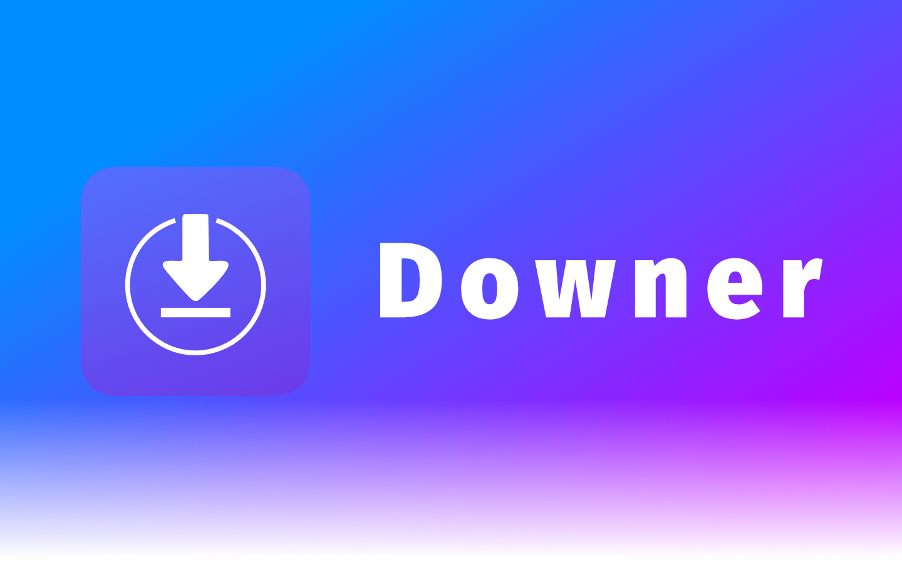

##### **Quickly download videos from YouTube, Instagram, and other popular sites on your Mac. (Linux support possible soon)**

### Key Features:

- Supports YouTube, Instagram, Vimeo, Twitter and more
- Simple user interface
- Download as audio only in mp3, wav and flac
- Download as mp4 or webm
- Easy access without the need to download online media from sketchy websites :)

---

# Disclaimer

The authors of Downer are not responsible/liable for any misuse of this program that may violate local copyright/DMCA laws. Users use this application at their own risk.

---

## Important note for developer

Unfortunately, the original git repo was mismanaged, so there is no real git history.